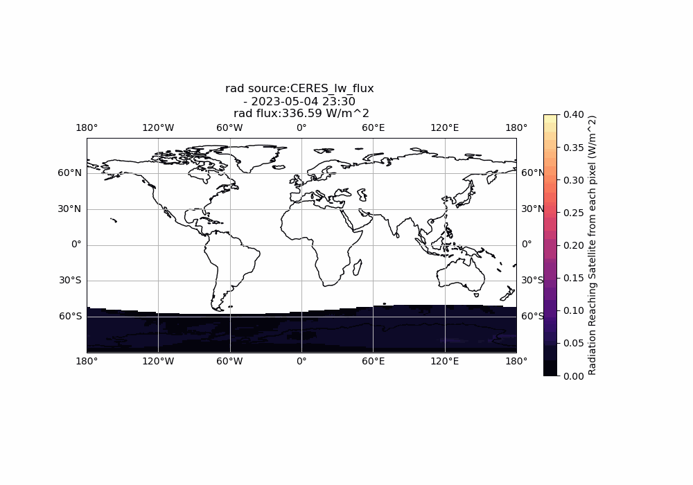
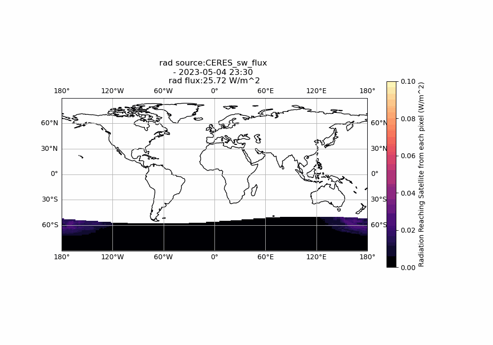

# ERP Tools

Calculate and visualize the radiative flux reaching a given satellite along its trajectory using ERP Tools. This toolset allows users to process satellite data and visualize radiative fluxes in various forms.

## Installation

To install the ERP Tools environment and dependencies, follow these steps:

1. Clone the ERP Tools repository:
   ```bash
   git clone https://github.com/CharlesPlusC/ERP_tools.git
   cd ERP_tools

2. Create and Active the conda environment:
   ```bash
   conda env create -f erp_tools_env.yml
   conda activate erp_tools_env
   ```

## Usage

After installing and activating the environment, you can run the toolset by executing the main script:

```bash
python main.py
```

Unfortunately, the only way to download CERES data is through the [ceres.larc.nasa.gov](https://ceres-tool.larc.nasa.gov/ord-tool/jsp/SYN1degEd41Selection.jsp). You will need to create an account and download the data manually. The data should be placed in the `data` directory.

Then in `main.py` replace the path variables with the path to the downloaded data.

This will calculate and plot an animation of the combined longwave and shortwave radiative flux based on the provided satellite trajectory information (currently reads and propagates a TLE but this can easily be modified to accept any ECI ephemeris).

### Combined Flux Animation
This particular animation combines both longwave and shortwave radiative fluxes:


## Example Output

The ERP Tools generate several GIFs that visualize the radiative flux. Here are some examples:

Longwave Hourly Flux:


Longwave Hourly Radiance at TOA:


Shortwave Hourly Flux:


Shortwave Hourly Radiance at TOA:


## Contributing
Contributions and Issues to ERP Tools are welcome.